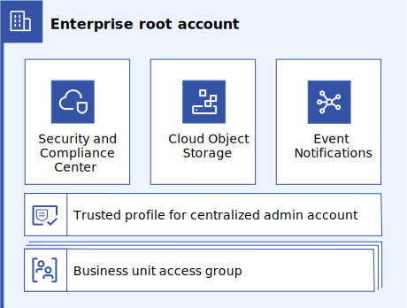

---

copyright:
  years: 2023
lastupdated: "2023-12-05"

subcollection: enterprise-account-architecture

keywords:

---

{{site.data.keyword.attribute-definition-list}}

# Security and Compliance Center account
{: #scc-account-structure}

The Security and Compliance Center and its dependencies are deployed in the root account of the enterprise to allow the Security and Compliance Center to scan all of the enterprise.
{: shortdesc}

The contents of this account are provisioned through infrastructure as code from the central administration account.

{: caption="Figure 1. Enterprise root account" caption-side="bottom"}

Scopes can be configured such that different profiles are used for the administration account group, each BU, or even each workload account if needed. The Security and Compliance Center should not be configured with scopes smaller than an account to ensure that controls related to account-level settings are properly covered.

To ensure security compliance enterprise wide, it is recommended that the Security and Compliance Center is configured to scan the entire enterprise, including accounts in the administration account group. Where possible, configure scopes at the account group level to ensure that new subaccounts are automatically covered by the Security and Compliance Center scans.

A significant number of users might need to view scan results. As these users need access to the enterprise root account, set up one or more access groups for viewing scan results. Alternatively, reports can be exported and shared outside of IBM Cloud.

| Component | Quantity | Description |
|-----------|--------------|----|
| Security and Compliance Center | 1 |  A single instance of Security and Compliance Center that is configured to scan the entire enterprise |
| Cloud Object Storage | 1 | Used to store security and compliance center results |
| Event Notifications | 1 | Used to provide notifications for select Security and Compliance Center alerts |
| Trusted Profile | 1 | Used to authorize the central administration account to deploy the other components in this account |
| Business unit access groups | n (1+ per BU) | Used to authorize users from a business unit to view scan results |
{: caption="Table 1. Components" caption-side="bottom"}

For more information about using a tusted profile to authorize the central administration account to deploy the other components in this account, see [Establishing trust with IBM Cloud services](/docs/account?topic=account-create-trusted-profile&interface=ui#create-profile-services).

## Rationale for centralizing the Security and Compliance Center
{: #central-scc}

The Security and Compliance Center is most valuable when all relevant resources are scanned with an appropriate profile. Reasoning about resource coverage can be difficult in the face of independent Security and Compliance Center instances, complex scope configuration, and complex account structures.

Centralizing the Security and Compliance Center and configuring broad scopes that cover the whole enterprise, or at least whole account groups within the enterprise, makes reasoning about resource coverage easy. This in turn, makes it easy to prove to internal and external auditors that all cloud resources within an audit scope are covered by appropriate Security and Compliance Center scans.

The Security and Compliance Center must be deployed in the root of the enterprise in order for it to be permitted to scan the entire enterprise.
{: note}
